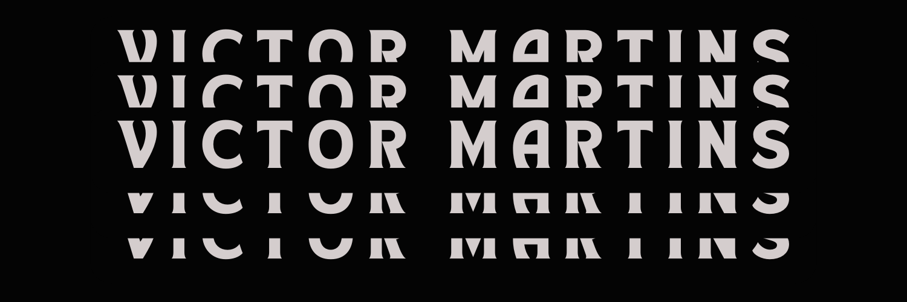

<h1 align="center">Oi 👋, Eu sou o Victor Hugo</h1>
<h3 align="center">Um desenvolvedor Full-Stack na Linear SM e estudante de Ciências da Computação na Unesp</h3>

- 🔭 Estou trabalhando atualmente na empresa **Linear Softwares Matemáticos** como desenvolvedor Full-Stack

- 🌱 Estou Estudando e trabalhando atualmente com **React, Node, Nest, TypeScript, .NET, ASP.NET, C#, SQL** com foco em desenvolvimento Back-End

- 🤝 Procuro ajudar em **Projetos que possam auxiliar no meu aprendizado**

- 💬 Tenho conhecimentos e gosto de conversar sobre: **C#, Java, JavaScript, TypeScript, Jquery, Python, HTML, CSS, C e SQL**

- 📫 Como me contatar **vmhugo00@gmail.com**

<h3 align="left">Outras formas de contato:</h3>

  <strong>Linguagens de Programação:</strong> 
  
  
  
  

  <strong>Frameworks do Back-end:</strong> 
  
  
  
  
  
  

  <strong>Frameworks do Front-end:</strong> 
  

  <strong>Banco de Dados:</strong> 
  
  
  

&nbsp;

